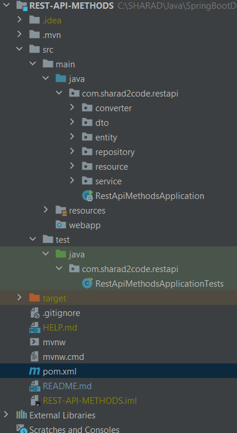

# REST API CRUD EXAMPLE

A complete example of a "CRUD" service (UserService) built with Oat++.

In this example:

- How to create CRUD endpoint.
- How to use mapstructs

## Overview

This project is using the following oatpp modules:

- [oatpp](https://github.com/oatpp/oatpp)


### Project layout



---

### Build and Run

#### Using CMake

##### Pre Requirements

- `oatpp`
- `oatpp-swagger`
- `oatpp-sqlite` with `-DOATPP_SQLITE_AMALGAMATION=ON` cmake flag.

**Note:** You may run `utility/install-oatpp-modules.sh` script to install required oatpp modules.

##### Build Project

```
$ mvn clean install
```

---

### Endpoints

#### HTML

|HTTP Method|URL|Description|
|---|---|---|
|`GET`|http://localhost:8000/sharad2code | Root page |
|`GET`|http://localhost:8000/swagger/ui | Swagger UI page |

#### Employee Service

|HTTP Method|URL|Description|
|---|---|---|
|`POST`|http://localhost:8000/sharad2code/employee | Create new Employee |
|`PUT`|http://localhost:8000/sharad2code/employee/{empid} | Update Employee by employee id |
|`GET`|http://localhost:8000/sharad2code/employee/{empId} | Get Employee by employee id |
|`DELETE`|http://localhost:8000/sharad2code/employee/{empId} | Delete Employee by employee id |
|`GET`|http://localhost:8000/sharad2code/employee/ | Get All Employees |